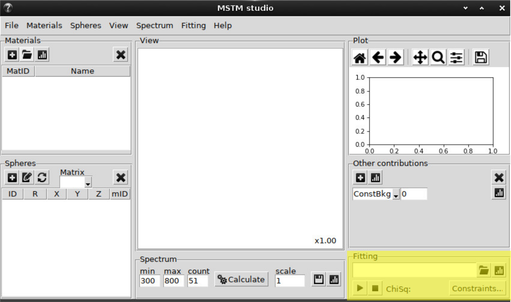
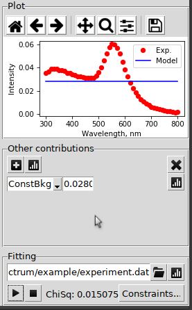
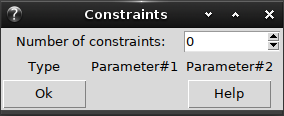
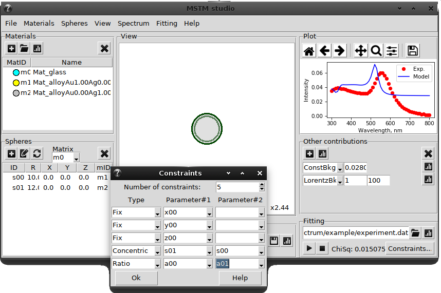

.. _gui_fitting:

Fitting and constraints
-----------------------

Open file -- select file with column-formatted data to fit

Plot button -- visualize data and compare it with theory

Play button -- start fitting

Stop button -- interrupt fitting

ChiSq -- shows the obtained fitting quality parameter :math:`\chi^2` (see :class:mstm_studio.mstm_spectrum.SPR).

Constraints button -- open new window with constraints options

Empty constraints window:

Example of possible constraints for core-shell nanoparticle:

For details consult :ref:`Constraints`

