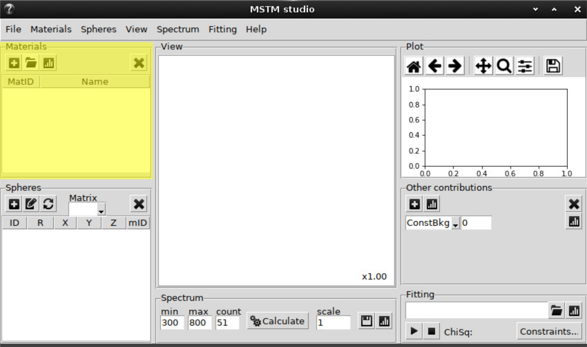
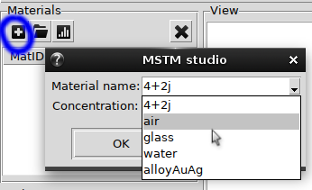
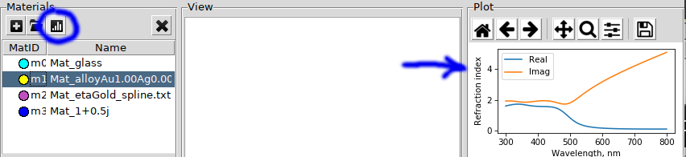

.. _gui_materials:

Materials
---------

Material can be added from the predefined list:

Also the complex number can be typed in here.

The option `AlloyAuAg` correspond to analytical parametrixation for silver-gold alloys [Rioux2014]_ and requires the specification of Au ratio (:math:`0 \le x \le 1`). 

Next button will add material from file with refractive index data stored in column format, i.e.::

    lambda	n	k
     0.100	2.8883	1.3062
     0.101	2.8735	1.2439
     0.101	2.8564	1.1856
     ...
 
First column -- wavelength in `nm` or `mum`, second and third -- real and imaginary parts of refractive index.

..   The confirmation dialog appear if there is one or more defined materials:

 
The refractive index data can be plotted to check sanity:

Cross button deletes the selected material.

