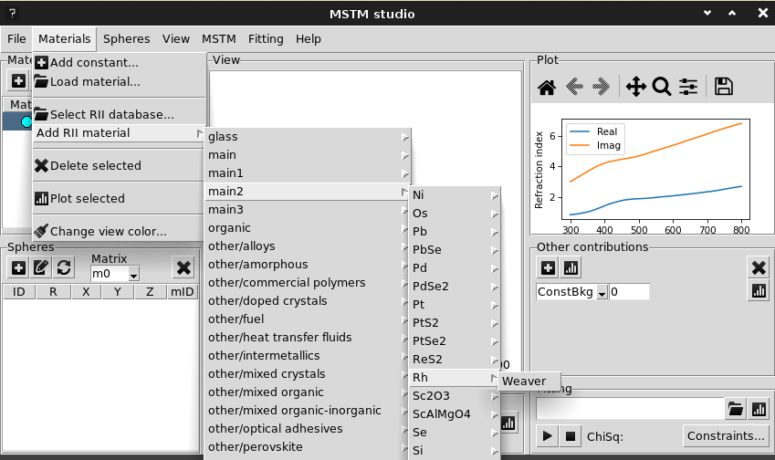

.. _gui_materials:

Materials
---------

.. image:: interface_material.png

Material can be added from the predefined list:

.. image:: gui_add_mat_1.png

Also the complex number can be typed in here.

The option `AlloyAuAg` correspond to analytical parametrixation for silver-gold alloys [Rioux2014]_ and requires the specification of Au ratio (:math:`0 \le x \le 1`). 

Next button will add material from file with refractive index data stored in column format, i.e.::

    lambda	n	k
     0.100	2.8883	1.3062
     0.101	2.8735	1.2439
     0.101	2.8564	1.1856
     ...
 
First column -- wavelength in `nm` or `mum`, second and third -- real and imaginary parts of refractive index.

..   The confirmation dialog appear if there is one or more defined materials:

 
The refractive index data can be plotted to check sanity:

.. image:: gui_mater_plot.png

Cross button deletes the selected material.

Materials from RefractiveIndex.Info
^^^^^^^^^^^^^^^^^^^^^^^^^^^^^^^^^^^

The materials can be loaded from the zip-archive of the RII database <https://refractiveindex.info/>. 
The archive can be downloaded from the website (in About section, `direct link<https://refractiveindex.info/download/database/rii-database-2024-12-31.zip>`_).

To link graphical interface with zip-archive:

1. Select window menu `Materials` -> `Select RII database`. 
1. The archive will be searched in standart pathes with mask `rii-database-*.zip`. Click `yes` to use autofound file. Otherwise - select downloaded archive in file tree.
1. After that the filtration of database will be prompted. Click `yes` to perform it (requires < 5 minutes). After that only suitable for optical calculation materials will remain. **Note**, that in the case if only real part of refraction index is specified, the imaginary one is set to zero.
1. Select the material (`shelf`, `book` and `page` in RII notation) from the menu `Materials` -> `Add RII material`. 

The specified material should appear in the materials list.

Alternatively, any material data can be downloaded from the website, but manual preparation of tabular file (wavelengths in nm, n and k columns) will be required.

