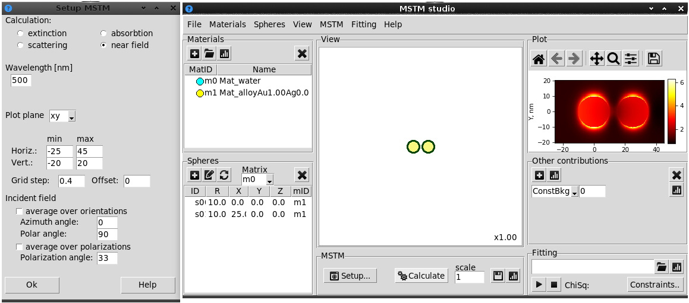

.. _gui_nearfield:

MSTM near-field
^^^^^^^^^^^^^^^

Near field calculation should be enabled in "Setup MSTM" window by selection of "near field" mode.
The adjustable options are:

"Wavelength [nm]" -- the wave length of the incident beam;

"Plot plane" -- the 2D plane orientation - XY, YZ or ZX;

"Horiz", "Vert", "min", "max" -- the minimal and maximal coordinate on the plane, in nm;

"Grid step" -- grid grain size, in nm;

"Offset" -- displace of the plane from the origin, can be positive or negative, in nm.

Averaging over the incidence beam orientation can not be performed, therefore "average over orientation" box is automatically unchecked. Orientation should be specified with "Azimuth angle" and "Polar angle" (in degrees).

Also, polarization of the beam should be fixed and specified with "Polarization angle".

Alternatively, the averaging over polarization can be done by **MSTM Studio** mimicing the natural polarization. In this case "average over polarization" box should be checked and number of polarization values (from 0 to 90 degrees) to be averaged should be specified (12 by default).

Obtained data can be saved as image or text file in the same way as for spectrum.

