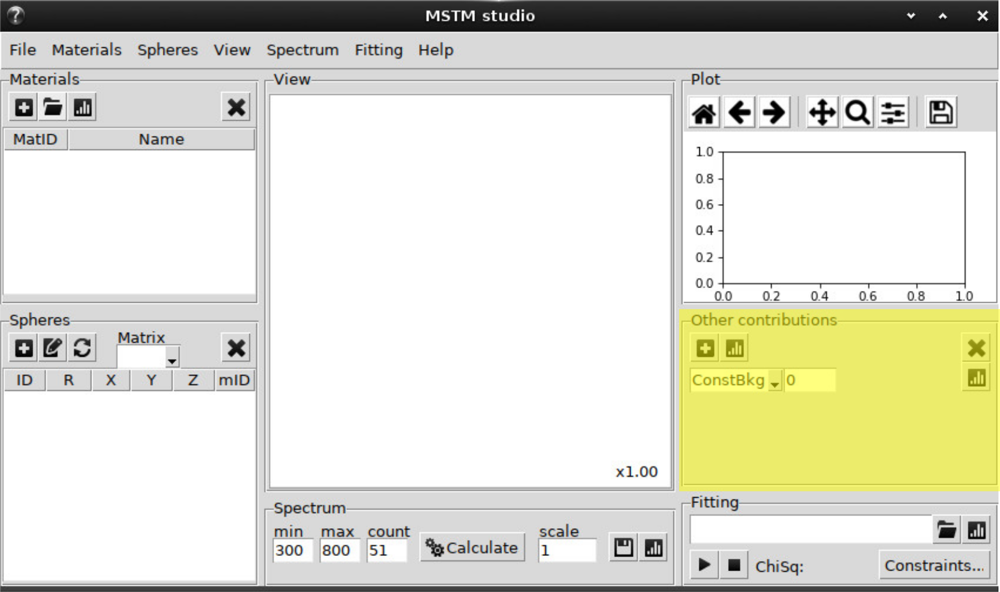
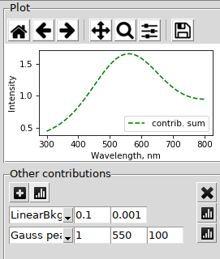

.. _gui_other:

Mie and other contributions
---------------------------

Plus button -- add new contribution, 

plot button -- plot the sum of all contributions,

cross button -- delete the last contribution in the list.

Each contribution has the type, a number of parameters and individual plot button.

Possible contributions and thier parameters:

1. ConstBkg -- constant background addition

    1.1. shift
    
2. LinearBkg -- linear background addition (see :class:`mstm_studio.contributions.LinearBackground`)

    2.1. shift
    
    2.2. slope
 
3. LorentzBackground -- background contribution mimicing UV-absorbtion of silica glass (see :class:`mstm_studio.contributions.LorentzBackground`) with center at ~ 250 nm. 

    3.1. scale
    
    3.2. peak width :math:`\Gamma`

4. Mie single -- extinction of single sphere (see :class:`mstm_studio.contributions.MieSingleSphere`)
    
    4.2. scale
    
    4.3. diameter (in nm)
    
    4.4. material label
   
    Note: the enviromnent material will be taken from `Matrix` field of `Spheres` panel.
    
5. Mie LN -- extinction of ensemble of non-interacting spheres with sizes disributed accordint to Log-Normal (LN) law (see :class:`mstm_studio.contributions.MieLognormSpheres`). Actually, the cached version of the class optimized for the fitting is used.
    
    5.1. scale
    
    5.2. LN parameter :math:`\mu`
    
    5.3. LN parameter :math:`\sigma`
    
    The new plot button will show the size distribution:
    
    .. image:: gui_mie_distrib.png
    
    Note: the window may require widening to show all the parameters and buttons.
    
6. Lorentz peak --  Lorentzian function (see :class:`mstm_studio.contributions.LorentzPeak`)

    6.1. scale
    
    6.2. center
    
    6.3. width
    
7. Gauss peak -- Gaussian function (see :class:`mstm_studio.contributions.GaussPeak`)
    
    7.1. scale
    
    7.2. center
    
    7.3. width    

8. Au film -- not implemented

9. bst-3Au/glass -- not implemented

