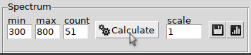
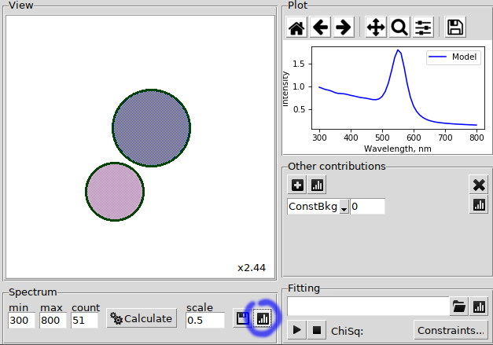

.. _gui_spectrum:

MSTM spectrum
^^^^^^^^^^^^^

The spectrum calculation may be configured by pressing the "Setup" button.
The relevant options in "Setup MSTM" window are:

"Calculation" mode could be extinction (default mode), absorbtion or scattering spectrum;

"min" -- minimal wavelength (in nm),

"max" -- maximal wavelength (in nm),

"count" -- number of wavelength points. By default the spacing is 10 nm;

By default the averaging is performed. If "average over orientations" is unchecked the incidence beam angles must be specified, i.e. "Azimuth angle" and "Polar angle". In this case the spectra for two polarization cases (parallel and orthogonal) will be obtained.

"Calculate" button of the main window runs MSTM binary in temporary directory (OS-dependent) and reads the results.

"scale" -- total outer multiplier.

save button -- save extinction to column file.

plot button -- plot without re-calculation (i.e. with new `scale`).

The plot controls are rendered by Matplotlib, and can depend on the library version. Generally, it is possible to zoom region of interest and save graphic as a raster or vector image.

