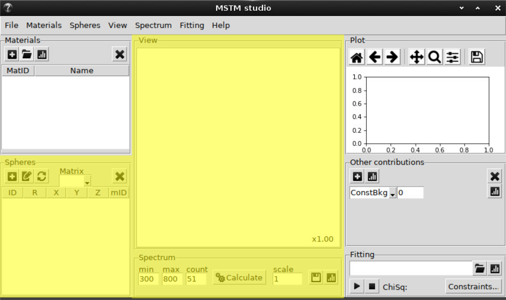
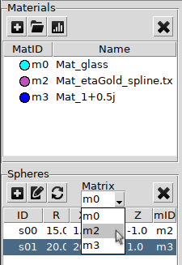

.. _gui_spheres:

Multi-Spheres T-Matrix
----------------------

Mutli-spheres T-matrix calculations are done by calling the external binary MSTMcode written by Mischenko and Mackowski. Currently supported are the spectra calculations (extinction, scattering or absorbtion) and near field visualization.
Both modes requires specification of the spheres geometry and thier material.
GUI provides the following options:

Plus button -- add new sphere.

.. image:: gui_spheres_add.png

Important to specify material label for the sphere.

Button with pencil or doulbe-click on a table row -- edit selected sphere. 

Note: double click on a row in material table allow to change the viewed material color.

Circle-arrows -- refresh 3D view.

3D view can be **rotated** with pressed left mouse button and **zoomed** in or out with mouse wheel.

Environment material by default is `m0`. This can be changed using menu:

Cross button deletes the selected sphere.

Calculation modes:

.. toctree::
   gui_spectrum
   gui_nearfield

