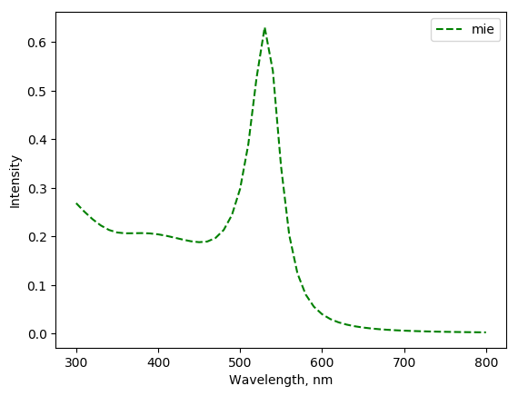
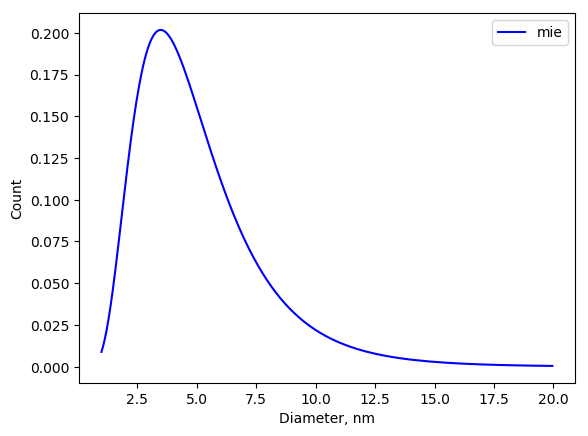

.. _contribs:

Simple functions and Mie theory
-------------------------------

Example
^^^^^^^

The example how to obtain contribution to the extinction from Log-Normally distributed spheres. Other contributions are evaluated in similar way.

.. literalinclude:: mie_contrib.py
   :lines: 3-12

.. literalinclude:: mie_contrib.py
   :lines: 14-16

Classes
^^^^^^^

.. automodule:: mstm_studio.contributions
    :members: Contribution, ConstantBackground, LinearBackground, LorentzBackground, LorentzPeak, GaussPeak, MieSingleSphere, MieLognormSpheres, MieLognormSpheresCached 

.. [Kreibig_book1995] U. Kreibig, M. Vollmer, "Optical Properties of Metal Clusters" (1995) 553

