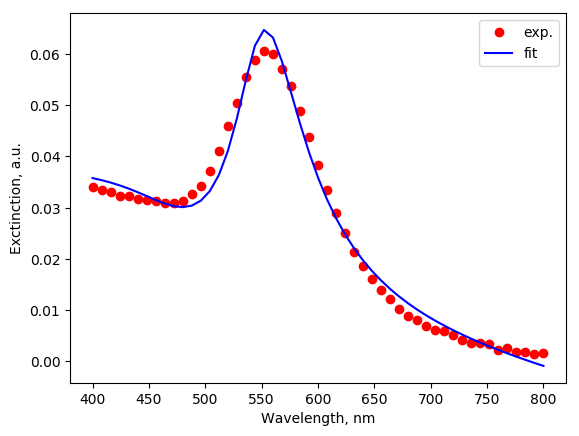
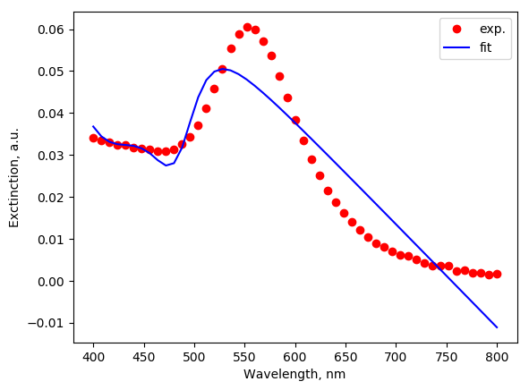

.. _fitting:

Fitting
-------

Fitting of experimental spectra is a powerful tool for study of plasmonic nanoparticles. 
Fitting with Mie theory is routinely used to provide information about particle sizes, but 
fitting with MSTM can solve even agglomerates (packs) of nanoparticles, where Mie theory is not
applicable, see [Avakyan2017]_ for example.
Another application is the fitting with core-shell or multi-layered particles.

The MSTM-studio used hard-coded target (penalty) function which is minimized during fitting (ChiSq):

.. math::

    \chi^2 = \sum_i \left( y_i^\text{(fit)} - y_i^\text{(dat)} \right)^2,    

where index `i` enumerates wavelengths.

Example: fit with Mie theory
^^^^^^^^^^^^^^^^^^^^^^^^^^^^

Exampels experimental file, included in distribution, is the extinction spectra of gold particles laser-impregnated in glass, 
synthesized and studied by Maximilian Heinz [Avakyan2017]_.

.. literalinclude:: fit_by_Mie.py
   :lines: 3-27

Output (final part)::

    ChiSq:	0.000219
    Optimal parameters
        ext00:	0.035177	(Varied:True)
        ext01:	-0.000049	(Varied:True)
        ext02:	0.007908	(Varied:True)
        ext03:	4.207724	(Varied:True)
        ext04:	0.284066	(Varied:True)
        scale:	7030.322097	(Varied:True)

The low value of `ChiSq` and inspecting of agreement between theoretical and experimental curves are 
indicate on *acceptable* fitting.
The names of fitting parameters are explained in Constraints subsection (see :class:`.Parameter`).
In this example the `ext00` and `ext01` are the parameters `a` and `b` of linear contribution,
`ext02` is a scale multiplier for Mie contribution, `ext03` and `ext04` correspond to `mu` and `sigma` 
parameters of Log-Normal distribution (see :class:`mstm_spectrum.MieLognormSpheres`).
The last parameter, the common `scale` multiplier 100 % correlates with `ext02`, resulting in spurious absolute values. 
If needed, the particle concentration can be estimated from thier product :math:`scale \times ext02` or by constraining one of them during fitting.

Fitter class
^^^^^^^^^^^^

.. autoclass:: mstm_studio.fit_spheres_optic.Fitter
    :members:

Constraints
-----------

The constraints allow to speed-up or direct the fitting. 
Thier setup requires specification of variable names, which are described in Parameter class documentation:

.. autoclass:: mstm_studio.fit_spheres_optic.Parameter
    :members:

Example: fit by core-shell
^^^^^^^^^^^^^^^^^^^^^^^^^^

Fit the same experiment as above, but using model of core-shell particle, just to illustrate the technique.

.. literalinclude:: fit_by_core-shell.py
   :lines: 3-35

Output (final part)::

    ChiSq:	0.002354
    Optimal parameters
	    a00:	1.284882	(Varied:True)
	    a01:	1.958142	(Varied:True)
	    ext00:	0.186312	(Varied:True)
	    ext01:	-0.000247	(Varied:True)
	    scale:	-0.063814	(Varied:True)
	    x00:	0.000000	(Varied:False)
	    x01:	0.000000	(Varied:False)
	    y00:	0.000000	(Varied:False)
	    y01:	0.000000	(Varied:False)
	    z00:	0.000000	(Varied:False)
	    z01:	0.000000	(Varied:False)

The fiting quality demonstrated by parameter ChiSq is ~10 times worse comparing when used the ensemble of non-interacting gold particles. 
The figure shows unacceptable fitting quality too.

Constraints classes
^^^^^^^^^^^^^^^^^^^

.. autoclass:: mstm_studio.fit_spheres_optic.Constraint
    :members:

.. autoclass:: mstm_studio.fit_spheres_optic.FixConstraint
    :members:
    
.. autoclass:: mstm_studio.fit_spheres_optic.EqualityConstraint
    :members:
    
.. autoclass:: mstm_studio.fit_spheres_optic.ConcentricConstraint
    :members:
    
.. autoclass:: mstm_studio.fit_spheres_optic.RatioConstraint
    :members:

.. [Avakyan2017] L. Avakyan, M. Heinz, A. Skidanenko, K. Yablunovskiy, J. Ihlemann, J. Meinertz, C. Patzig, M. Dubiel, L. Bugaev "Insight on agglomerates of gold nanoparticles in glass based on surface plasmon resonance spectrum: Study by multi-spheres T-matrix method" J. Phys.: Condens. Matter (2018) *30*, 045901-045909 <https://doi.org/10.1088/1361-648X/aa9fcc>

