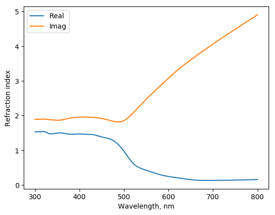
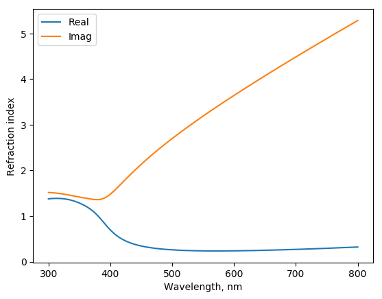

.. _materials:

Materials
---------

The materials are characterized by refractive index, which is a square root (complex valued) of macroscopic dielectric function.
Generally, this should be the spectral function, i. e. 

.. math::

    n_c(\lambda) = n(\lambda) + i \cdot k(\lambda) = \sqrt{ \epsilon_1(\omega) + i \cdot \epsilon_2(\omega) }

so that

.. math::

    n = \sqrt{(|\epsilon|+\epsilon_1)/2} \\
    k = \sqrt{(|\epsilon|-\epsilon_1)/2}

with :math:`\hbar \omega = 2 \pi \hbar c / \lambda`.

Constant Material
^^^^^^^^^^^^^^^^^

The material with constant refreactive index can be specified as first constructor argument (`file_name`)::

    >>> from mstm_studio.mstm_spectrum import Material
    >>> mat_glass = Material('1.5')
    >>> mat_glass.get_n(500)
    array(1.5)

Complex value can be supplied too::

    >>> mat_lossy = Material('3+1j')
    >>> mat_lossy.get_n(500)
    array(3.)
    >>> mat_lossy.get_k(500)
    array(1.)

Also the predifned names can be used: `air`, `water`, `glass`.

Loading from file
^^^^^^^^^^^^^^^^^

The tabular data on refractive index is convinient to store in file.
The header of the file required to have special labels: ``lambda	n	k``. The example file "etaGold.txt" can be found in directory "nk" of source distribution.

Assuming the file "etaGold.txt" is in the same directory where script is running, it can be loaded with

.. literalinclude:: load_gold.py
   :lines: 3-5

Resulted plot

.. Note:: The extending database of refractive indeces of materials <https://refractiveindex.info/>.

Material from numpy array
^^^^^^^^^^^^^^^^^^^^^^^^^

Material data can be specified directly by numpy (complex) array by passing `nk` or `eps`.
Next examples shows loading of Drude-like dielectric function:

.. literalinclude:: drude_gold.py
   :lines: 1-12

Material class members
^^^^^^^^^^^^^^^^^^^^^^

.. autoclass:: mstm_studio.mstm_spectrum.Material
   :members:
   

Analytical formula for AuAg
^^^^^^^^^^^^^^^^^^^^^^^^^^^

Silver, gold and thier alloy materials can be specified using analytical expression proposed in the study [Rioux2014]_.
Example for Au:Ag = 1:2 alloy:

.. literalinclude:: mat_au1ag2.py
   :lines: 1-5

Resulted plot

.. autoclass:: mstm_studio.alloy_AuAg.AlloyAuAg
   :members:

Materials from RefractionIndex.Info 
^^^^^^^^^^^^^^^^^^^^^^^^^^^^^^^^^^^

Online database of materials RII [RII]_ <https:\\refractiveindex.info> provides 
dielectric functions of a several hundreds of materials. Up to Dec 2024
it contains 445 different materials ("books" in RII notation) and 
163 of them are suitable for calculations in MSTM-Studio 
(i.e. contain tabulated data with wavelength in interval from 300 to 800 nm).

Materials can be loaded from the local dump of online database, which can be 
obtained from the official RII website (About->Resources, direct link: 
<https://refractiveindex.info/download/database/rii-database-2024-12-31.zip>).

By default `mstm_studio` will search for `rii-database-*.zip` archive in home directory and in application data directory. 
The exact location may be determined in argument of class constructor.

Example: Compare refraction indeces of silver of different authors

.. literalinclude:: mat_rii_ag.py
   :lines: 1-29

Resulted plot

.. image:: size_correction.png

.. autoclass:: mstm_studio.rii_materials.RiiMaterial
   :members:

Size correction for dielectric functions
^^^^^^^^^^^^^^^^^^^^^^^^^^^^^^^^^^^^^^^^

Macroscopic dielectric function obtained for bulk samples can be applied 
to nanoparticles with caution. 
It is claimed that only particles of radius above 10 nm can be considered. 
However, the consideration can be extended to the sizes down to ~ 2 nm
by inclusion of the most prominent effect -- the decrease of 
the mean free path length of electrons due to finite size of the 
nanoparticles.
The correction is applied to the :math:`\gamma` parameter of the Drude
function, so that we had to add the contribution

.. math::

    \Delta \epsilon(\omega, D) = 
    	{\epsilon}_{Drude, corr.}(\omega, D) - 
    	{\epsilon}_{Drude}(\omega, D=\infty)

to the experimental dielectric function given by the table.

Example for 3 nm gold nanoparticle:

.. literalinclude:: size_correction.py
   :lines: 1-19

Resulted plot

.. image:: size_correction.png

Currently the corrections for gold and silver are implemented:

.. autoclass:: mstm_studio.diel_size_correction.SizeCorrectedGold
   :members:

.. autoclass:: mstm_studio.diel_size_correction.SizeCorrectedSilver
   :members:

Also the general correction class is available:

.. autoclass:: mstm_studio.diel_size_correction.SizeCorrectedMaterial
   :members:
   

.. [Rioux2014] D. Rioux, S. Vallières, S. Besner, P. Muñoz, E. Mazur, and M. Meunier, "An Analytic Model for the Dielectric Function of Au, Ag, and their Alloys" Adv. Opt. Mater. (2014) *2* 176-182 <http://dx.doi.org/10.1002/adom.201300457>

.. [RII] M. N. Polyanskiy, "Refractiveindex.info database of optical constants" Sci. Data (2024) *11*, 94 <https://doi.org/10.1038/s41597-023-02898-2>

