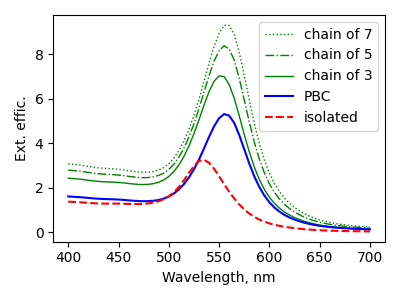
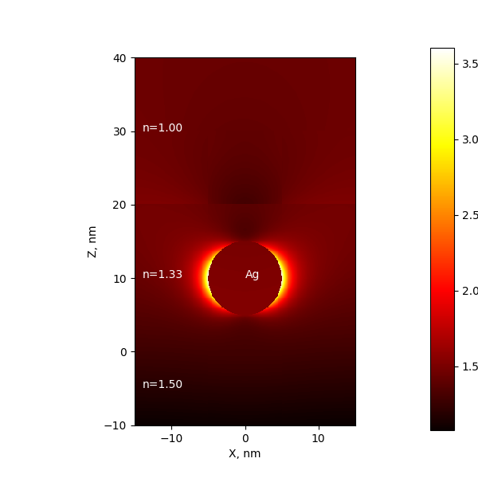

.. _matrix:

Matrix Setup - Layers and Periodicity
-------------------------------------

The newest MSTM code (version 4) introduces periodic boundary conditions (in XY plane) 
and matrix layers (in Z direction). 
Periodic boundary can be setup with `set_boundary` method of SPR_v4 class,
and layers - with `set_layers`. 
Both spectra and near field calculations are allowed. 

Important: this works only in latest releases of MSTM. This wrapper was tested
for 2023 year release (github.com/dmckwski/MSTM/tree/main/december2023). 
The compiled binaries are supplied in our repositary (https://github.com/lavakyan/mstm-spectrum/releases).

.. warning::
    Near field calculations with MSTM v.4 sometimes 
    give strange results. Investigation in the process. 

Of course, no sphere allowed to intercept PBC and layer limits.

Periodic boundary conditions
^^^^^^^^^^^^^^^^^^^^^^^^^^^^

Periodic boundary conditions (PBC) in MSTMv4 can be setup only in XY plane. 
The returned values are 
- reflectance (`R`),
- absorptance (`A`),
- transmittance (`T`)
coefficients for parallel, orthogonal orientations (suffices '_par' and '_ort'. 
Also stored the orientation-averaged values.
The coefficients should be 0 .. 1 interval, but for closely placed spheres,
with low gap between particles, `T` can become negative.

The extinction cross section can be calculated from transmittance as [Kreibig_book1995]_:

.. math::

   \sigma_{ext} = - \frac{1}{n L} ln(T),

where `n` is a particle number density  and `L` is an optical length. 
Note, that negative `T` will produce `NaN` values.

Since :math:`n = N / (L_x L_y L)`, optical length does not affect the cross section and

.. math::

   \sigma_{ext} = - \frac{L_x L_y}{N} ln(T),

where :math:`L_x` and :math:`L_y` are periodic cell parameters, and `N` is number of spheres. 

Since other calculation modes returns efficiencies, not cross sections, the division by
effective scattering area is performed in the code. 
However, the estimation of multple spheres area is tricky. 
Currently it is evaluated simply as :math:`\sum_i \pi R_i^2` which may be wrong if 
spheres projections overlap.

The general recommendation is to use more reliable `T`, `A` and `R` values 
stored after caclulation as the fields of SPR object.

Example: chain of nanoparticles
"""""""""""""""""""""""""""""""

The following script compares extinction spectra 
of 
- isolated particle,
- finite group of particles in line,
- infinite chain of particles (usinf PBC).

.. literalinclude:: example_periodic_chain.py
   :lines: 2-65

Output figure:

   
Layered matrix
^^^^^^^^^^^^^^

By default there is no layers and matrix spans for all space -inf < Z +inf. 
The material constants for matrix are set up in the usual way, by specifiing 
`environment_material` property. I.e. `spr.environment_material = Material(1.5)`.

The single layer boundary is added by specifieng list of one material in `set_layers` method:

.. code::
     spr.set_layers([mat])

After that the negative Z half space (-inf < Z < 0) is described with `environment_material`
and positive (0 < Z < +inf) with `mat` passed to this method.

The further increase of layer numbers required specification of list of thier depths. 
Note, that length of matrices list should be bigger by 1 than lengths of depths list.
MSTMv4 has hard-coded maximal amount of layers. 

Example: Silver particle in layer
"""""""""""""""""""""""""""""""""

The nearfield from 10 nm Ag particle in a water layer of 20 nm depth on a glass.

.. literalinclude:: example_periodic_chain.py
   :lines: 2-34

Output figure:

MSTM v4 classes
^^^^^^^^^^^^^^^

.. autoclass:: mstm_studio.mstm_v4.SPR_v4
    :members:

.. autoclass:: mstm_studio.mstm_v4.NearField_v4
    :members: 

