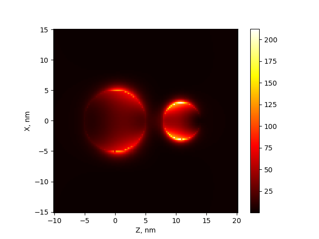

.. _nearfield:

Visualization of near field 
---------------------------

MSTM code can be used to calculate the distribution of the near (or local) field.
The field is calculated on a rectangular region, specified by input (:class:`nearfield.NearField.set_plane`).
Currently, only magnititude of electric field :math:`|E|^2` can be visualized.

Example: field distribution near two particles
^^^^^^^^^^^^^^^^^^^^^^^^^^^^^^^^^^^^^^^^^^^^^^

Two silver spheres with radii 5 and 3 nm are placed at 0,0,0 and 0,0,11. 
Incident beam with wavelength is 385 nm is directed by Z axis and have X polzarization.

.. literalinclude:: mstm_nearfield.py
   :lines: 2-17

Resulting image

    

Class
^^^^^

.. autoclass:: mstm_studio.nearfield.NearField
    :members:

