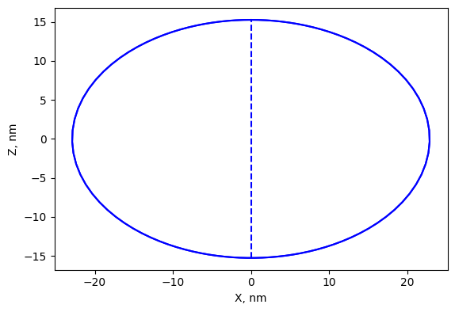
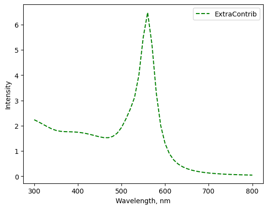

.. _nonspherical:

Non-spherical particle shapes
-----------------------------

T-matrix formulation allows to perform computational efficient calculations for single axially-symmtric objects. 
Currently supported only spheroid shape (rotational ellipsoid) using external library ScatterPy <https://github.com/TCvanLeth/ScatterPy>. The details can be found in [Mishchenko1998]_.

Example
^^^^^^^

Calculation of extinction for oblate spheroid with aspect ratio of :math:`\alpha=a/c=`1.5. 
The size is specified by diamter :math:`a_{eff}` of equivalent-volume sphere.

The spheroid size can be derived as

.. math::

   a = a_{eff} \alpha^{1/3} \\
   c = a / \alpha

.. literalinclude:: spheroid_contrib.py
   :lines: 2-12

.. literalinclude:: spheroid_contrib.py
   :lines: 14-20

Class
^^^^^

.. automodule:: mstm_studio.contrib_spheroid
    :members: SpheroidSP

.. [Mishchenko1998] M. Mishchenko, L. Travis, "Capabilities and limitations of a current FORTRAN implementation of the T-matrix method for randomly oriented, rotationally symmetric scatterers " (1998) 309

