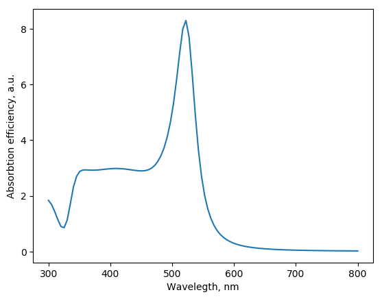

.. _spheres:

Spheres setup
-------------

MSTM code requires explicit setup of the positons and sizes of spheres. There are several classes designed in MSTM-studio to help this setup.

Example: particles aggregate
^^^^^^^^^^^^^^^^^^^^^^^^^^^^

Script to construct spheres with random sizes placed on a regular grid:

.. literalinclude:: spheres_aggr.py
   :lines: 1-8

Sample output::

    Box size estimated as: 77.0 nm
    Desired number of particles: 9
    Number of particles in a box: 8
    Resulted number of particles: 8
    spheres are overlapping, regenerating...
    Box size estimated as: 77.0 nm
    Desired number of particles: 9
    Number of particles in a box: 8
    Resulted number of particles: 8
    [ 9.307773    8.61185299  9.92867988  8.84140858  9.87175352  8.71090184
      9.71505038 12.40459688]

    

Classes
^^^^^^^

.. autoclass:: mstm_studio.mstm_spectrum.Spheres
    :members:

.. autoclass:: mstm_studio.mstm_spectrum.SingleSphere
    :members:

.. autoclass:: mstm_studio.mstm_spectrum.ExplicitSpheres
    :members:

.. autoclass:: mstm_studio.mstm_spectrum.LogNormalSpheres
    :members:
    
    
MSTM run
--------

T-matrix formalism prposed by Waterman [Khlebtsov2013]_ is one of the generalization of Mie theory towards the multiple spherical targets. 
The Multi Sphere T-matrix (MSTM) Fortran code is developed by Mischnko and Mackowsky [Mackowski2011]_. 
The `SPR` class implements functionality required for extinction spectra calculation in visible range. 
Note, that Fortran code have wider functionality, including near field calculations, angle-dependent calculations, etc, which are not currently implemented. 
Consult the MSTM website <http://eng.auburn.edu/users/dmckwski/scatcodes/> for details.

Example: core-shell particle
^^^^^^^^^^^^^^^^^^^^^^^^^^^^

Absorbtion efficiency (normalized cross-section) of gold-silver core-shell particle.

.. literalinclude:: core-shell_mstm.py
   :lines: 3-21

Class
^^^^^

.. autoclass:: mstm_studio.mstm_spectrum.SPR
    :members:

.. [Khlebtsov2013] N. Khlebtsov, "T-matrix method in plasmonics: An overview" J. Quant. Spectrosc. Radiat. Transfer (2013) *123*, 184-217, Peter C. Waterman and his scientific legacy 

.. [Mackowski2011] D. Mackowski, M. Mishchenko,"A Multiple Sphere T-matrix Fortran Code for Use on Parallel Computer Clusters" J. Quant. Spectrosc. Radiat. Transfer (2011) *112*, 2182–2192

